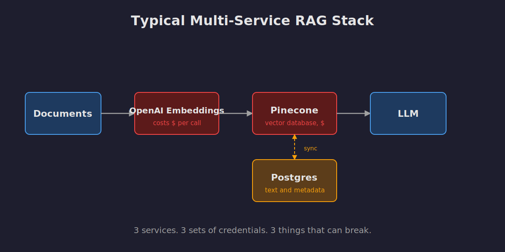
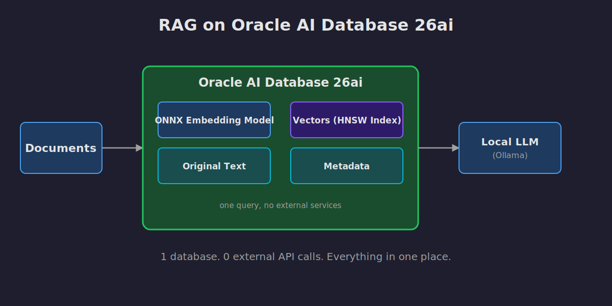
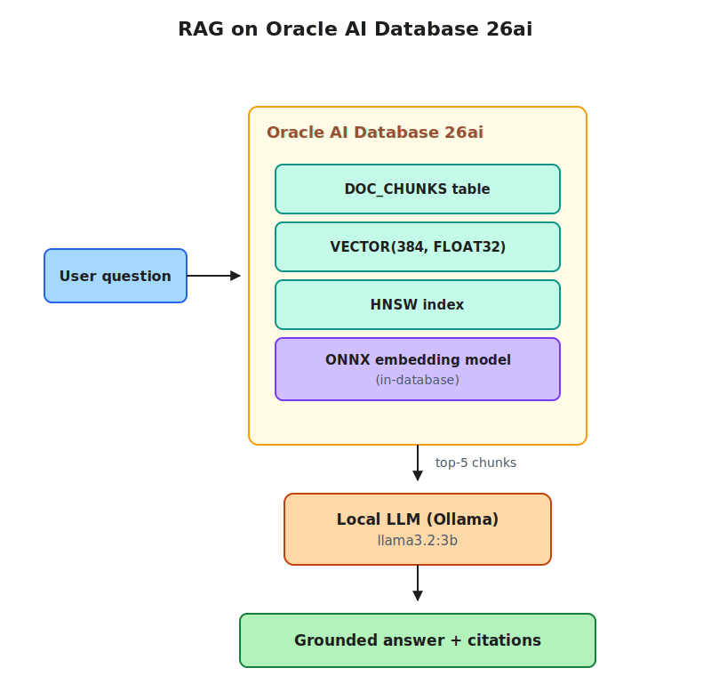

# RAG on Oracle AI Database 26ai

A complete Retrieval-Augmented Generation (RAG) application that runs entirely on Oracle AI Database 26ai. Embeddings are generated inside the database, vectors live alongside the source text, and LangChain orchestrates the chat. No external embedding service. No separate vector store. No paid APIs in the critical path.

The demo answers questions about Oracle AI Database 26ai by retrieving relevant passages from three of Oracle's official documentation PDFs and grounding the LLM's response in the source text. Each answer ships with citations back to the exact pages used.

## Highlights

- **In-database embeddings.** The pre-built `all-MiniLM-L12-v2` ONNX model lives inside Oracle. Embeddings are generated by SQL with `VECTOR_EMBEDDING()`, no external service needed.
- **Native vector storage.** Each chunk is one row with a `VECTOR(384, FLOAT32)` column. HNSW index for fast similarity search.
- **LangChain integration.** The official `langchain-oracledb` package powers retrieval. About 20 lines of LangChain Expression Language (LCEL).
- **Multi-document corpus.** Pulls from three Oracle docs (Vector Search, JSON, Database Concepts) so cross-document retrieval is visible.
- **Free to run.** Oracle AI Database Free in Docker, local LLM through Ollama. Zero external API spend.

## What you'll need

| Tool | Why | Install |
|---|---|---|
| Docker Desktop or Podman | Runs Oracle AI Database Free locally | [docker.com](https://www.docker.com) |
| Python 3.11 or higher | Runs the seed script and the chat UI | [python.org](https://www.python.org) |
| Ollama | Runs a local LLM so no paid API is required | [ollama.com](https://ollama.com) |

About 15 GB of free disk for the Oracle image and the local LLM.

## Setup

These steps take you from a fresh clone to a working chat in about 10 minutes (most of which is the database starting up and the embedding model downloading).

### 1. Clone the repo

```bash
git clone https://github.com/Emminex23/rag-on-oracle-26ai.git
cd rag-on-oracle-26ai
```

### 2. Run the one-time setup

```bash
make setup
```

This creates a Python virtual environment in `.venv/`, installs every package in `requirements.txt`, and copies `.env.example` to `.env`.

### 3. Start the database

```bash
make db-up
```

The first time you run this, Docker pulls the Oracle Free image (about 10 GB). Subsequent starts take seconds.

The database needs about 60 seconds to initialize on cold start. Check progress:

```bash
make db-status
```

When STATUS shows `(healthy)`, you're ready.

### 4. Configure the database for HNSW indexing

```bash
make db-init
```

This connects to the database as SYSDBA, sets `VECTOR_MEMORY_SIZE = 512M`, and restarts the database. The 512 MB allocation enables in-memory HNSW vector indexes.

The restart takes about 60 seconds. Wait for `make db-status` to show `(healthy)` again.

### 5. Pull the local LLM

```bash
ollama pull llama3.2:3b
```

This downloads about 2 GB. Run it once and forget about it.

### 6. Load the documents and embeddings

```bash
make seed
```

This script:

1. Downloads the pre-built `all-MiniLM-L12-v2` ONNX embedding model from Oracle (about 130 MB, one time).
2. Downloads three Oracle documentation PDFs (about 25 MB total, one time).
3. Creates the demo user (`raguser`) with the right tablespace and privileges.
4. Loads the ONNX model into the database so embeddings can be generated in SQL.
5. Chunks every PDF and inserts each chunk into the `DOC_CHUNKS` table. Embeddings are generated by the database itself with `VECTOR_EMBEDDING()`.
6. Builds an HNSW vector index for fast similarity search.

The whole script runs in about 90 seconds.

### 7. Launch the chat UI

```bash
make run
```

Streamlit will open `http://localhost:8501` in your browser. Try the suggested questions or ask your own.

## Architecture

A typical RAG application stitches together at least three different services: an embedding API, a dedicated vector database, and a separate store for the original text and metadata. Each service costs money, adds latency, and is one more thing that can break.



This project collapses all of that into a single Oracle AI Database. The embedding model, the vectors, the original text, and the metadata all live inside the database. The only piece that runs outside is the LLM, and even that runs locally through Ollama, so the whole application makes zero external API calls.



The full request flow looks like this:



## Try these questions

The corpus spans three documents, so the most interesting questions are ones that pull from across them. Each answer panel shows which document each retrieved chunk came from.

**From a single document:**

- *How do I load an ONNX embedding model into Oracle?* (Vector Search Guide)
- *What is JSON Relational Duality?* (JSON Developer's Guide)
- *How does ACID consistency work in Oracle?* (Database Concepts)

**Cross-document (the interesting ones):**

- *Can I query JSON columns with vector search?*
- *How does ACID consistency apply to vector data?*
- *Compare HNSW indexes with regular B-tree indexes.*

## Project structure

```
rag-on-oracle-26ai/
├── README.md             this file
├── docker-compose.yml    starts Oracle AI Database 26ai locally
├── requirements.txt      Python dependencies
├── .env.example          environment variable template
├── Makefile              one-command shortcuts
├── seed.py               loads the ONNX model, the PDFs, and the chunks
├── app.py                Streamlit chat UI with LangChain LCEL chain
├── retrieval.sql         standalone retrieval query
├── data/                 model and PDF downloads (gitignored)
├── docs/
│   └── images/
│       ├── architecture.svg
│       ├── multi_service_rag.svg
│       └── oracle_only_rag.svg
└── scripts/
    └── init_db.sql       one-time database configuration
```

## Make targets

| Command | What it does |
|---|---|
| `make setup` | Create venv, install dependencies, copy `.env` |
| `make db-up` | Start the Oracle Database container |
| `make db-status` | Show database container status |
| `make db-init` | Configure VECTOR_MEMORY_SIZE for HNSW (one-time) |
| `make db-down` | Stop the database (keeps data) |
| `make seed` | Load the embedding model and source PDFs |
| `make run` | Launch the Streamlit chat UI |
| `make clean` | Remove downloaded data files (keeps DB and venv) |
| `make reset` | Wipe everything and start over |


